# Emotes

## Controls
Press the `END` key on your keyboard (or `Ctrl`+`E`) to bring up the menu on the right-side of the chatbox.

Navigate the menu with the Arrow keys, pressing the `Enter` key to paste an emote into your chat input window. You can also search for emotes.

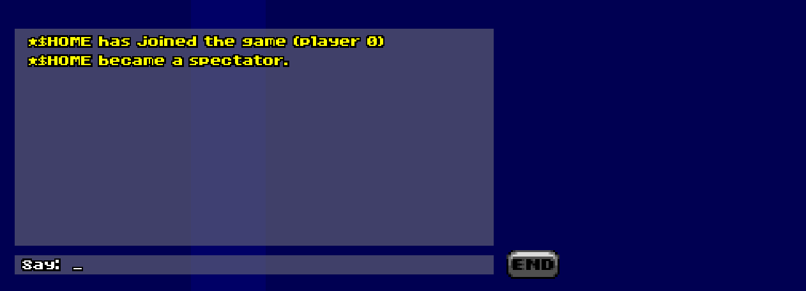

Moreover, a preview of emotes will appear below your chat input window when typing an emote.  

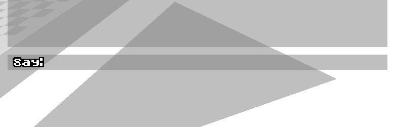

Press `Tab` to autocomplete.

## Overview
By _default_, the build configures a few in-game graphics as emotes:

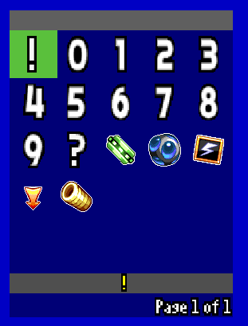

> What an exciting selection.

And `radioracers.pk3` contains a default set of emotes.

:sob:, :fire:, all of that.

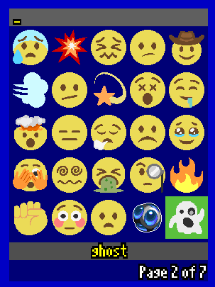

> `>gets hit by spb`
> 
> \<Player\> :sob::sob::sob:

## Process
When loading an addon with any emotes, the build will check for two things:
1. an `EMOTEDEF` or `ATLASDEF` file 
2. the subsequent lumps, which will act as "frames" for the emotes

### Configuration
#### EMOTEDEF
```
Name = <YOUR CUSTOM EMOTE NAME HERE>
Tics = <FRAME DELAY OF ANIMATED EMOTE IN TICS>
```
<details>
    <summary>Static emote</summary>

```
Name = <YOUR CUSTOM EMOTE NAME HERE>
```

You only need the `Name` entry.
</details>

<details>
    <summary>Animated emote</summary>

```
Name = <YOUR CUSTOM EMOTE NAME HERE>
Tics = <FRAME DELAY OF ANIMATED EMOTE IN TICS>
```

Animated emotes should be GIFs and GIFs have a frame delay. Convert the frame delay (milliseconds)  to tics.

Here's the formula:

$$\text{tic\_delay} =\lfloor \frac{\text{frame\_delay} + 14}{28} \rfloor$$

Let's say a GIF has a frame delay of 30ms:

$\lfloor \frac{\text{30} + 14}{28} \rfloor$ = $\lfloor \frac{\text{44}}{28} \rfloor$ = $1.57$

So, the emote would have a delay of **1 tic** (rounded down).
</details>


### ATLASDEF
```
Rows = <TOTAL NUMBER OF ROWS IN ATLAS>
Columns = <TOTAL NUMBER OF COLUMNS IN ATLAS>
Width = <WIDTH OF EACH EMOTE>
Height = <HEIGHT OF EACH EMOTE>

Emote<N> = <NAME OF EMOTE>
```

`<N>` represents a sequential number, starting from 1 (e.g., `Emote1`, `Emote2`, etc).

## Adding emotes

<details>
    <summary>Static emotes</summary>

Let's say you'd want to add a single `:peach:` emote:


You'd rename the image file to `FRAME001` and your `EMOTEDEF` file would look like this:
```
Name = peach
```
Altogether, here's how the final result should look inside the PK3:

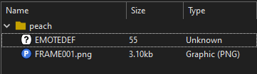
</details>

<details>
    <summary>Atlas emotes</summary>

Let's say you'd want to add multiple static emotes at once, same width, same height:

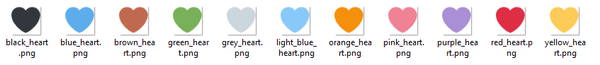
> Get it? Cos Earthbound invented hearts!

Using your favourite image editor, you can compile the images into a single "atlas", like so:

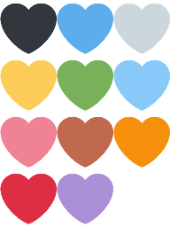

The final image should be named `EMOATLAS`.

In this example, each heart emoji is `128px` by `128px`. The final atlas consists of `4` rows and `3` columns.  
 Therefore, the `ATLASDEF` should be configured as follows:

<table style="border: none">
  <tr style="border: none">
    <td style="width: 60%; border: none"><pre><code>
Rows = 4
Columns = 3
Width = 128
Height = 128
<br>
Emote<span style="color:#AAFF00">1</span> = black_heart
Emote<span style="color:#AAFF00">2</span> = blue_heart
Emote<span style="color:#AAFF00">3</span> = grey_heart
Emote<span style="color:#AAFF00">4</span> = yellow_heart
Emote<span style="color:#AAFF00">5</span> = green_heart
Emote<span style="color:#AAFF00">6</span> = light_blue_heart
Emote<span style="color:#AAFF00">7</span> = pink_heart
Emote<span style="color:#AAFF00">8</span> = brown_heart
Emote<span style="color:#AAFF00">9</span> = orange_heart
Emote<span style="color:#AAFF00">10</span> = red_heart
Emote<span style="color:#AAFF00">11</span> = purple_heart
    </code></pre></td>
    <td style="width: 40%; border: none">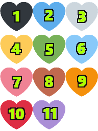</td>
  </tr>
</table>

Altogether, here's how the final result should look inside the PK3:

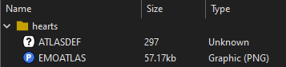
</details>

<details>
    <summary>Animated emotes</summary>

Let's say you'd want to add an animated emote called `:pbjt:`, using this GIF:

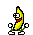

You'd have to extrct each frame from the GIF and rename them sequentially, starting from `FRAME001.png`, `FRAME002.png`, and so on, depending on how long the animation is:

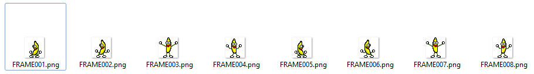

This particular GIF has a frame delay of 100ms, which, using the formula mentioned earlier, converts to a delay of `4 tics`. Therefore, the final `EMOTEDEF` should be configured as follows:

```
Name = pbjt
Tics = 4
```

Altogether, here's how the final result should look inside the PK3:

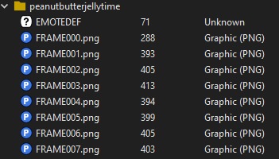
</details>

## "STFU!!11 How do I add my own? :middle_finger::rage::middle_finger:"

> TL;DR Consider using [radiolib](https://github.com/blondedradio/radiolib).

That's what `radioracers_plus.pk3` is for. By default, it's empty.  

However, the build checks for its existence, and if it's found, any emotes within are automatically added. 

So, all <span style="font-size: 2rem">you</span> have to do is:

1. Gather all your favourite unfunny vtuber emotes
2. Put them in `radioracers_plus.pk3`
3. ???
4. Profit!

Manually, this can be _very_ time-consuming and is prone to human-error.  

Therefore, I'd recommend using [radiolib](https://github.com/blondedradio/radiolib) to get the job done.


